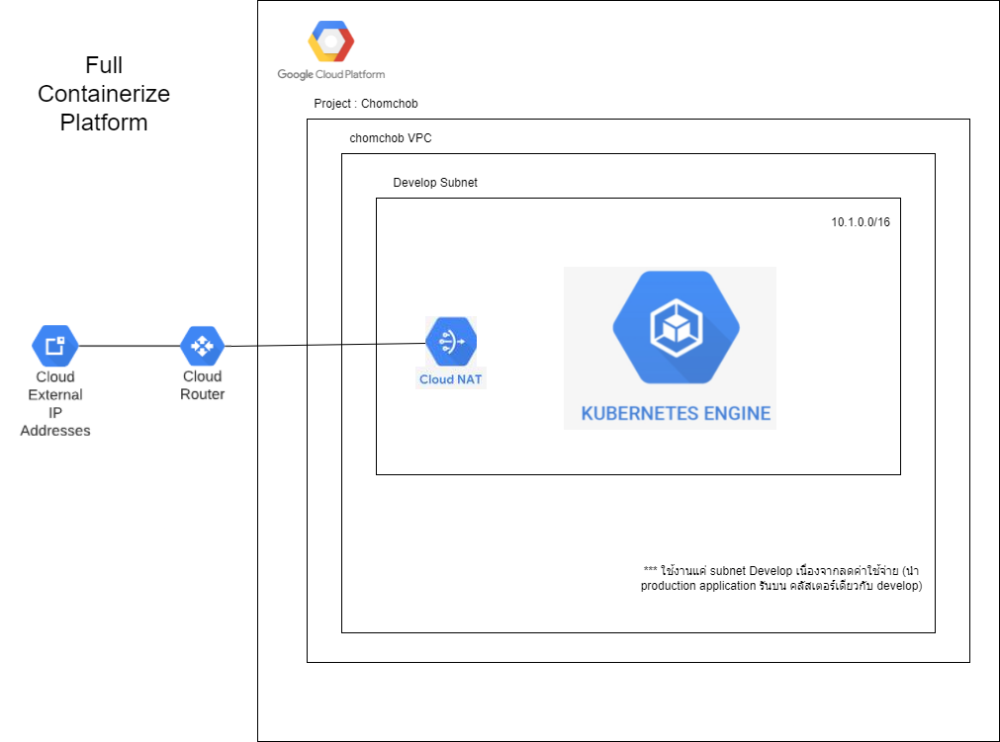
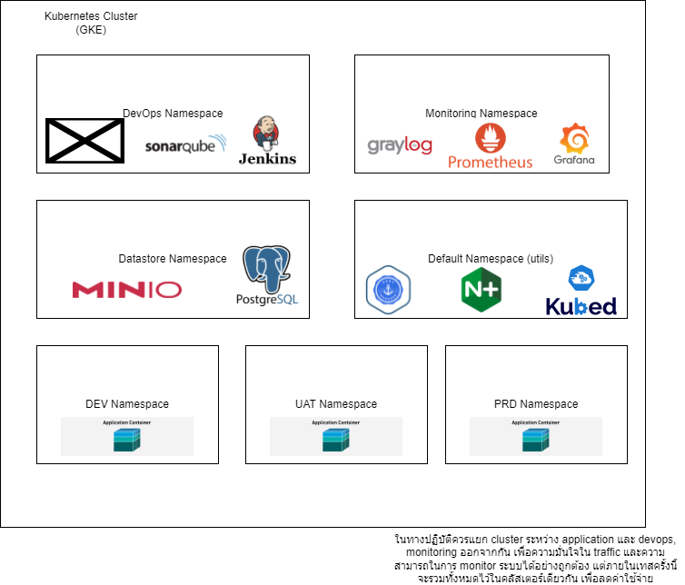
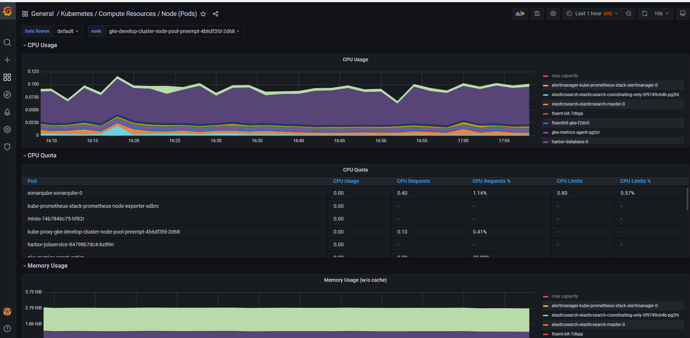
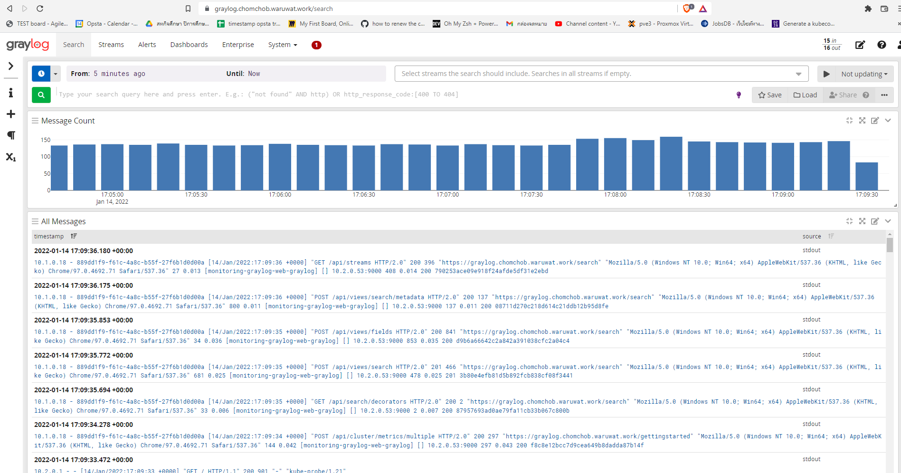
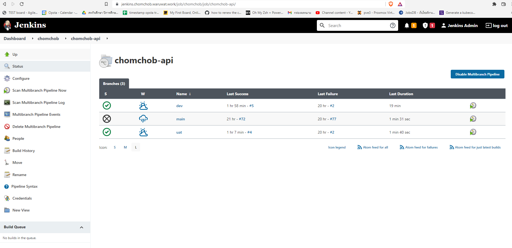
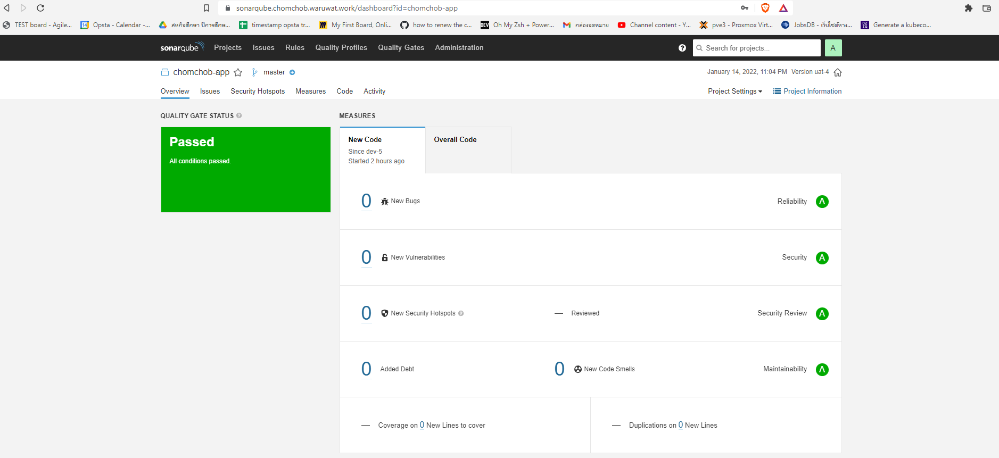

# ChomCHOB DevOps Testing

## DevSecOps platform on GCP create by Terraform

**Git Repository Infrastucture** : 
**Git Repository Application** :

## Infrastructure Architecture Diagram

## Kubernetes Architecture Diagram

## About

"ชมชอบเทส โดยนี้เป็นการสร้าง environment พร้อมใช้งาน สำหรับการจัดการ DevSecOps platform ทั้งหมด โดยการ Config และสร้าง environment นี้เป็นการทำ infrastructure as code แทบทั้งหมด (ยกเว้น บาง config เช่น sync secret wildcard สำหรับ verify https) ประกอบไปด้วยการทำ CI/CD ไปจนถึงการ Monitoring ที่ครอบคลุมทั้ง Logs และ Metric มีการตรวจสอบความปลอดภัยได้จากทั้ง source code และ image และ ยังมีการใช้งาน private registry สำหรับการจัดการ image ของแอปลิเคชั่นเพื่อเพิ่มความปลอดภัย และมีการทำ cost optimization โดยเลือก node เป็นแบบ preemitive ลดการใช้ public ip สำหรับ node และอื่นๆ โดยรายละเอียดเพิ่มเติมต่างๆนอกเหนือจากที่กล่าวไว้ในเอกสารนี้ สามารถสอบถามเพิ่มเติมได้ที่ waruwat.work@gmail.com"

> หมายเหตุ นี้เป็นเพียงสำหรับการทดสอบเท่านั้น จึงมีบางอย่างที่ต้องลดการใช้งานลง เช่น ควรแยก cluster production ออกมา เพื่อไม่ให้มีการแย่ง traffic กันระหว่าง การใช้งานของ services อื่นๆ เช่น jenkins

## Stack List

### Monitoring Tools

- graylog
- fluent-bit
- prometheus
- grafana
- alertmanager
- elasticsearch

### DevOps Tools

- jenkins
- sonarqube (source code scaner)
- harbor (private registry and trivy image scan)

### Utils Toolsl

- cert-manager
- config-syncer
- minio
- postgresql

### Endpoint

#### URL Monitoring Tools

https://graylog.chomchob.waruwat.work
https://alertmanager.chomchob.waruwat.work
https://grafana.chomchob.waruwat.work
https://prometheus.chomchob.waruwat.work

#### URL DevOps Tools

https://core-harbor.chomchob.waruwat.work
https://jenkins.chomchob.waruwat.work
https://sonarqube.chomchob.waruwat.work

#### URL Application

https://app.chomchob.waruwat.work
https://app-dev.chomchob.waruwat.work
https://app-uat.chomchob.waruwat.work

> สำหรับ username password ของแต่ละ services ผมจะส่งให้ที่ทาง email people@chomchob.com

> cluster นี้จะถูกทำลายลงภายใน 1 อาทิตย์หลังจากนี้ (22 JAN 2022)

## Demo

